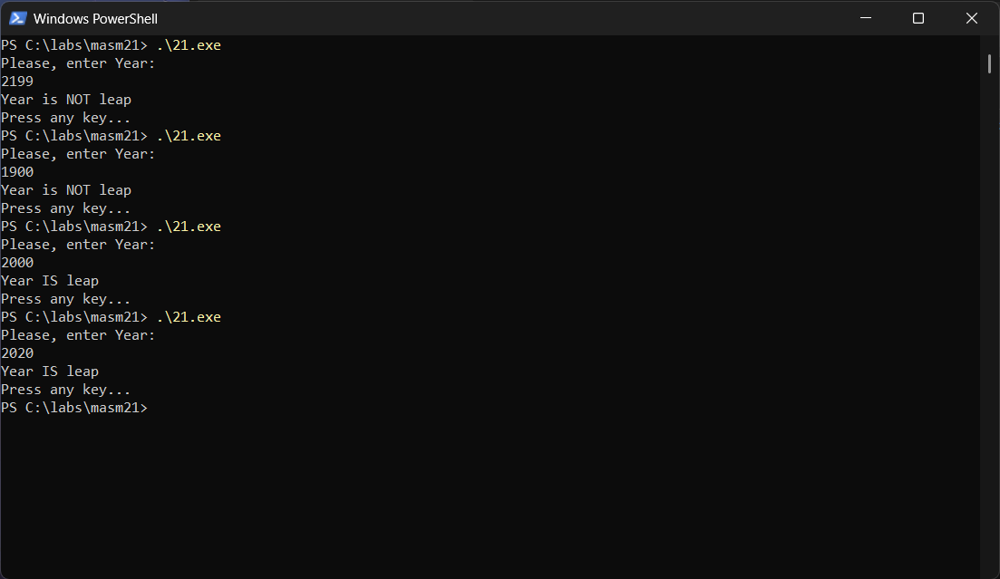

<div align="center">

МИНИСТЕРСТВО ТРАНСПОРТА РОССИЙСКОЙ ФЕДЕРАЦИИ  
ФЕДЕРАЛЬНОЕ АГЕНТСТВО ЖЕЛЕЗНОДОРОЖНОГО ТРАНСПОРТА  
Государственное бюджетное образовательное учреждение  
высшего образования  
**«ПЕТЕРБУРГСКИЙ ГОСУДАРСТВЕННЫЙ УНИВЕРСИТЕТ  
ПУТЕЙ СООБЩЕНИЯ ИМПЕРАТОРА АЛЕКСАНДРА I»**  

Кафедра «ИНФОРМАЦИОННЫЕ И ВЫЧИСЛИТЕЛЬНЫЕ СИСТЕМЫ»  

---

Дисциплина: «Программирование Ассемблер»

<br><br><br>
<br><br><br>

### О Т Ч Е Т

### по лабораторной работе № 2.1

</div>

<br><br><br>
<br><br><br>

<div align="right">
  <table align="right" style="border: none;">
    <tr>
      <td style="text-align: left; border: none;">
        Выполнил студент<br>
        Факультета АИТ<br>
        Группы ИВБ-515<br>
        Принял
      </td>
      <td style="text-align: right; border: none; vertical-align: bottom; padding-left: 50px;">
        Нартов С. А.<br>
        <br>
        <br>
        Кукин M. Ю.
      </td>
    </tr>
  </table>
</div>

<br><br><br>
<br><br><br>
<br><br><br>
<br><br><br><br><br>

<div align="center">
  Санкт-Петербург<br>  
  2026<br>
</div>


# *Задача*

Написать программу для определения, високосный год, или нет.

# *Листинг*

```ass
.586p
.model flat, stdcall
option casemap: none
include C:\masm32\include\windows.inc
include C:\masm32\include\kernel32.inc
includelib C:\masm32\lib\kernel32.lib
include C:\masm32\include\user32.inc
includelib C:\masm32\lib\user32.lib
include C:\masm32\include\masm32.inc  
includelib C:\masm32\lib\masm32.lib  
include C:\masm32\include\msvcrt.inc  
includelib C:\masm32\lib\msvcrt.lib
include C:\masm32\macros\macros.asm


.data      
  dwBytes     dd 0        
  szAppName    db "Nartov 2.1",0  
  
  ; Сообщения
  messagestart  db "Please, enter Year: ",13,10
  messagesizestart equ $-messagestart
  
  message0    db "Year is NOT leap"
  messagesize0  equ $-message0 
  
  message1    db "Year IS leap"
  messagesize1  equ $-message1
  
  NewLine    db 13,10


.data? 
  textstring    db 10 dup(?)
  textstringsize  dd  ?
  hStdOut     HANDLE  ?
  hStdIn      HANDLE  ?
  intedYear   dd      ?


.code
main PROC
  ;full console customize
  invoke SetConsoleTitleA, addr szAppName
  invoke GetStdHandle, STD_OUTPUT_HANDLE
  mov hStdOut, EAX
  invoke GetStdHandle, STD_INPUT_HANDLE
  mov hStdIn, EAX

  ; enter and read
  invoke WriteConsole, hStdOut, addr messagestart, messagesizestart, addr dwBytes, 0
  invoke ReadConsole, hStdIn, addr textstring, LENGTHOF textstring, addr textstringsize, 0
  
  ; clear 13,10
  lea   esi,   [textstring]
  add   esi,   textstringsize
  sub   esi,   2                  ; -(13,10)
  mov   word   ptr   [esi], 0     ; Заменяем на нулевой терминатор для atodw

  invoke atodw, addr textstring
  mov intedYear, EAX       ; Сохраняем год в переменную

  ;check to 4
  mov EAX, intedYear
  Xor EDX,  EDX
  mov EBX,  4
  div EBX           ; EAX / 4, остаток в EDX
  cmp EDX,  0          ; Проверка: делится на 4?
  jne NotLeap         ; Если нет -> не високосный

  ;check to 100
  mov EAX, intedYear
  Xor EDX,  EDX
  mov EBX, 100
  div EBX           ; EAX / 100
  cmp EDX, 0          ; Проверка: делится на 100?
  jne IsLeap          ; Если НЕ делится на 100 -> високосный

  ; check to 400
  mov EAX, intedYear
  Xor EDX,  EDX
  mov EBX, 400
  div EBX           ; EAX / 400
  cmp EDX, 0          ; Проверка: делится на 400?
  je IsLeap

NotLeap:
  invoke WriteConsole, hStdOut, addr message0, messagesize0, addr dwBytes, 0
  jmp ProgrEnd

IsLeap:
  invoke WriteConsole, hStdOut, addr message1, messagesize1, addr dwBytes, 0

ProgrEnd:
  ; Вывод пустой строки для красоты
  invoke WriteConsole, hStdOut, addr NewLine, 2, addr dwBytes, 0
  
  ; Пауза перед выходом
  inkey "Press any key..."
  
  invoke ExitProcess, 0
main ENDP
end main
```

# *Отладка*



# *Вывод*

Я научился проводить проверки и совершать переходы в языке masm32
