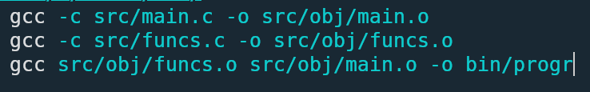
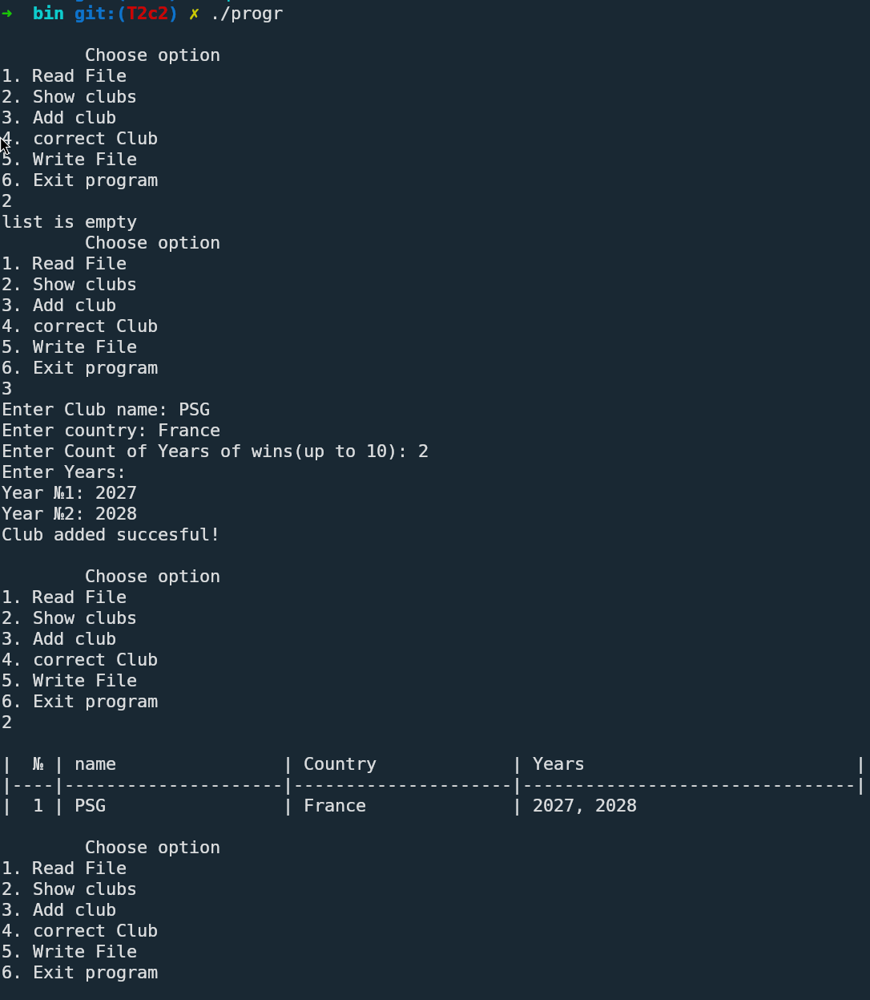
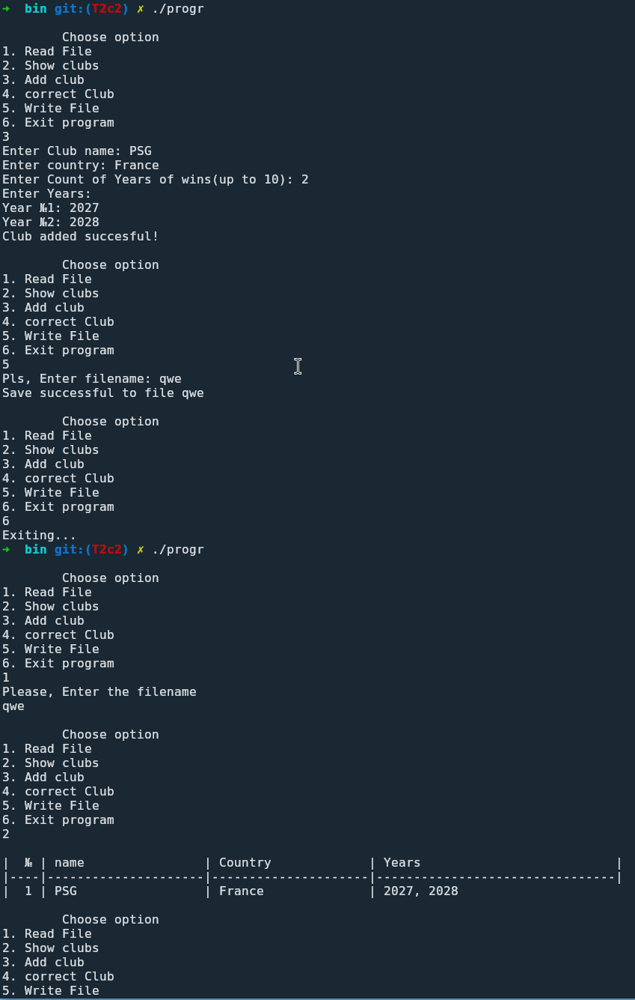

<div align="center">

МИНИСТЕРСТВО ТРАНСПОРТА РОССИЙСКОЙ ФЕДЕРАЦИИ  
ФЕДЕРАЛЬНОЕ АГЕНТСТВО ЖЕЛЕЗНОДОРОЖНОГО ТРАНСПОРТА  
Государственное бюджетное образовательное учреждение  
высшего образования  
**«ПЕТЕРБУРГСКИЙ ГОСУДАРСТВЕННЫЙ УНИВЕРСИТЕТ  
ПУТЕЙ СООБЩЕНИЯ ИМПЕРАТОРА АЛЕКСАНДРА I»**  

Кафедра «ИНФОРМАЦИОННЫЕ И ВЫЧИСЛИТЕЛЬНЫЕ СИСТЕМЫ»  

---

Дисциплина: «Программирование C»

<br><br><br>
<br><br><br>

### О Т Ч Е Т

### по лабораторной работе № 2

</div>

<br><br><br>
<br><br><br>

<div align="right">
  <table align="right" style="border: none;">
    <tr>
      <td style="text-align: left; border: none;">
        Выполнил студент<br>
        Факультета АИТ<br>
        Группы ИВБ-515<br>
        Принял
      </td>
      <td style="text-align: right; border: none; vertical-align: bottom; padding-left: 50px;">
        Нартов С. А.<br>
        <br>
        <br>
        Носонов В.Ю.
      </td>
    </tr>
  </table>
</div>

<br><br><br>
<br><br><br>
<br><br><br>
<br><br><br><br><br>

<div align="center">
  Санкт-Петербург<br>  
  2026<br>
</div>

# *Цель Работы*

Создать массив структур. Данными массива должны быть структуры
соответствующего варианта. Создать функции для записи и чтения массива в
текстовый и бинарный файлы .
Реализовать минимум все функции, приведённые в лекции, предложить свои
варианты функций работы со структурами.
Создать меню для управления работы со структурами .
В меню должны быть также пункты для сохранения данных на диске (имя
файла запрашивается), чтения и просмотра файла, корректировки,
добавления, работы с динамической памятью.

## Постановка задачи 1

Листинг

main.c
```c
#include <stdio.h>
#include <stdlib.h>
#include "struct.h"
#include "funcs.h"


int main(){
  struct Club *clubs = NULL;
  int clbCnt = 0;

  int choise = 0;
  do {
  printf("\n");
  printf("\tChoose option\n1. Read File\n2. Show clubs\n3. Add club");
  printf("\n4. correct Club\n5. Write File\n6. Exit program\n");

  scanf("%d", &choise);
  switch (choise) {
    case 1:
      ReadFile(&clubs, &clbCnt);
      break;

    case 2:
      ShowClubs(clubs, clbCnt);
      break;

    case 3:
      AddClub(&clubs, &clbCnt);
      break;

    case 4:
      ChangeClub(clubs, clbCnt);
      break;

    case 5:
      WriteFile(clubs, clbCnt);
      break;

    case 6:
      printf("Exiting...\n");
      free(clubs);
      break;

    default:
      printf("WIP(or u enter wrong number)");
      break;
  }
  } while (choise != 6);
  return 0;
}
```

funcs.h
```c
#include <stdio.h>
#include <stdlib.h>
#include <string.h>
#include "struct.h"

void ReadFile(struct Club **arr, int *cnt);

void ShowClubs(struct Club *clbArr, int cnt);

void AddClub(struct Club **arr, int *count);

void ChangeClub(struct Club *arr, int cnt);

//------------------------------------------------------------------

void WriteFile(struct Club *arr, int cnt);
```

funcs.c
```
#include "funcs.h"
#include <stdio.h>

void ReadFile(struct Club **arr, int *cnt){
	char filename[128];
	printf("Please, Enter the filename\n");
	while (getchar() != '\n');
	fgets(filename, 128, stdin);

	filename[strcspn(filename, "\n")] = '\0';
	FILE *file = fopen(filename, "r");
	if (file == NULL){
		printf("file wasnt found");
		return;
	}

	int newClbsCnt = 0;
	fscanf(file, "%d\n", &newClbsCnt);

	if (*arr != NULL) {
  	free(*arr);
  }

	struct Club *newArrClb = (struct Club*) malloc(newClbsCnt * sizeof(struct Club));

	for (int i = 0; i < newClbsCnt; i++){
		fscanf(file, "%[^;];", newArrClb[i].name);
		fscanf(file, "%[^;];", newArrClb[i].country);
		fscanf(file, "%d", &newArrClb[i].victoryCnt);

		for (int q = 0; q < newArrClb[i].victoryCnt; q++){
			fscanf(file, ";%d", &newArrClb[i].victoryYr[q]);
		}
		fscanf(file, "\n");
	}

	fclose(file);
	*arr = newArrClb;
	*cnt = newClbsCnt;
	return;
}

void ShowClubs(struct Club *clbArr, int cnt){
	if (cnt == 0){
		printf("list is empty");
		return;
	}


	printf("\n");
  printf("|  № | name                | Country             | Years                          |\n");
  printf("|----|---------------------|---------------------|--------------------------------|\n");
	for (int i = 0; i < cnt; i++) {
		printf("| %2d | %-19s | %-19s | ", i + 1, clbArr[i].name, clbArr[i].country);
		
		for (int j = 0; j < clbArr[i].victoryCnt; j++) {
			printf("%d", clbArr[i].victoryYr[j]);
		  if (j < clbArr[i].victoryCnt - 1) {
		    printf(", ");
		  }
		}
		
		if (clbArr[i].victoryCnt == 0) {
		    printf("Нет побед");
		}
		printf("\n");
    }

	return;
}
void AddClub(struct Club **arr, int *count) {
  struct Club new_club;
  
  while (getchar() != '\n');
  
  printf("Enter Club name: ");
  fgets(new_club.name, sizeof(new_club.name), stdin);
  new_club.name[strcspn(new_club.name, "\n")] = '\0';
  
  printf("Enter country: ");
  fgets(new_club.country, sizeof(new_club.country), stdin);
  new_club.country[strcspn(new_club.country, "\n")] = '\0';
  
  printf("Enter Count of Years of wins(up to 10): ");
  scanf("%d", &new_club.victoryCnt);
  
  if (new_club.victoryCnt > 10) {
  	new_club.victoryCnt = 10;
  	printf("UP TO 10\n");
  }
  
  if (new_club.victoryCnt > 0) {
  	printf("Enter Years:\n");
  	for (int i = 0; i < new_club.victoryCnt; i++) {
  		printf("Year №%d: ", i + 1);
  		scanf("%d", &new_club.victoryYr[i]);
  	}
  }
  
  // Перевыделение памяти
  struct Club *new_arr = (struct Club*)realloc(*arr, (*count + 1) * sizeof(struct Club));
  if (new_arr == NULL) {
  	printf("realloc error!\n");
  	return;
  }
  
  new_arr[*count] = new_club;
  (*count)++;
  *arr = new_arr;
  printf("Club added succesful!\n");
}

//------------------------------------------------------------------

void ChangeClub(struct Club *arr, int cnt){
	if (cnt == 0){
		printf("nothing to change");
		return;
	};

input_of_index:
	int clbToChange;
	printf("Enter number of club to change");
	scanf("%d", &clbToChange);

	if (clbToChange < 1 || clbToChange > cnt){
		printf("wrong club index");
		goto input_of_index;
	}

	clbToChange--;
	while (getchar() != '\n');	

	printf("Editing the %s\n", arr[clbToChange].name);

	char buffer[100];

	printf("Pls, Enter new name (Return to save existing): ");
  fgets(buffer, sizeof(buffer), stdin);
  buffer[strcspn(buffer, "\n")] = '\0';
  if (strlen(buffer) > 0)
    strcpy(arr[clbToChange].name, buffer);

  printf("Pls, Enter new Country (Return to save existing): ");
  fgets(buffer, sizeof(buffer), stdin);
  buffer[strcspn(buffer, "\n")] = '\0';
  if (strlen(buffer) > 0)
  	strcpy(arr[clbToChange].country, buffer);
  
  char cnt_buf[20];
input_new_victory_cnt:
  printf("Pls, Enter new wins Count (Return to save existing): ");
  fgets(cnt_buf, sizeof(cnt_buf), stdin);
  cnt_buf[strcspn(cnt_buf, "\n")] = '\0';
  if (strlen(cnt_buf) > 0) {
  	int new_cnt = atoi(cnt_buf);
  	if (new_cnt <= 10) {
  		arr[clbToChange].victoryCnt = new_cnt;
  	} else {
  		printf("UP TO 10\n");
  		goto input_new_victory_cnt;
  	}
  }

	if (arr[clbToChange].victoryCnt > 0) {
  printf("Pls, Enter new wins Count (Return to save existing): \n");
  for (int i = 0; i < arr[clbToChange].victoryCnt; i++) {
    printf("Victory Year №%d: ", i + 1);
    char year_buf[20];
    fgets(year_buf, sizeof(year_buf), stdin);
    year_buf[strcspn(year_buf, "\n")] = '\0';
  	if (strlen(year_buf) > 0) {
        arr[clbToChange].victoryYr[i] = atoi(year_buf);
      }
  	}
	}
    
  printf("Update successful!\n");
	return;
}

//------------------------------------------------------------------

void WriteFile(struct Club *arr, int cnt){
  if (cnt == 0) {
    printf("\nNothing to save.\n");
    return;
  }
    
  char filename[128];
  printf("Pls, Enter filename: ");
    
  while (getchar() != '\n');
  fgets(filename, 128, stdin);
  filename[strcspn(filename, "\n")] = '\0';
    
  FILE *file = fopen(filename, "w");
  if (file == NULL) {
    printf("Error open %s to write!\n", filename);
    return;
  }
    
  fprintf(file, "%d\n", cnt);
    
  for (int i = 0; i < cnt; i++) {
    fprintf(file, "%s;%s;%d", 
      arr[i].name, 
      arr[i].country, 
      arr[i].victoryCnt);
        
  	for (int j = 0; j < arr[i].victoryCnt; j++) {
    	fprintf(file, ";%d", arr[i].victoryYr[j]);
  	}
  	fprintf(file, "\n");
  }
    
  fclose(file);
  printf("Save successful to file %s\n", filename);

	return;
}
```

struct.h
```c
#pragma once
struct Club{
  char name[20];
  char country[20];
  int  victoryYr[10];
  int  victoryCnt;
};
```

компиляция


вывод


