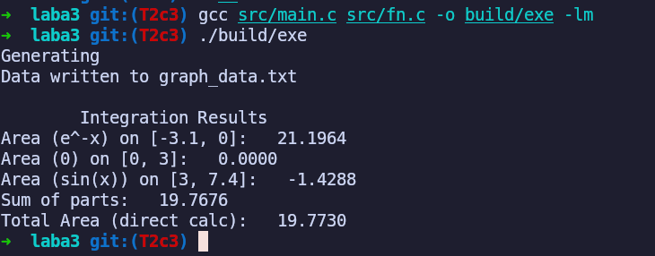

<div align="center">

МИНИСТЕРСТВО ТРАНСПОРТА РОССИЙСКОЙ ФЕДЕРАЦИИ  
ФЕДЕРАЛЬНОЕ АГЕНТСТВО ЖЕЛЕЗНОДОРОЖНОГО ТРАНСПОРТА  
Государственное бюджетное образовательное учреждение  
высшего образования  
**«ПЕТЕРБУРГСКИЙ ГОСУДАРСТВЕННЫЙ УНИВЕРСИТЕТ  
ПУТЕЙ СООБЩЕНИЯ ИМПЕРАТОРА АЛЕКСАНДРА I»**  

Кафедра «ИНФОРМАЦИОННЫЕ И ВЫЧИСЛИТЕЛЬНЫЕ СИСТЕМЫ»  

---

Дисциплина: «Программирование C»

<br><br><br>
<br><br><br>

### О Т Ч Е Т

### по лабораторной работе № 3

</div>

<br><br><br>
<br><br><br>

<div align="right">
  <table align="right" style="border: none;">
    <tr>
      <td style="text-align: left; border: none;">
        Выполнил студент<br>
        Факультета АИТ<br>
        Группы ИВБ-515<br>
        Принял
      </td>
      <td style="text-align: right; border: none; vertical-align: bottom; padding-left: 50px;">
        Нартов С. А.<br>
        <br>
        <br>
        Носонов В.Ю.
      </td>
    </tr>
  </table>
</div>

<br><br><br>
<br><br><br>
<br><br><br>
<br><br><br><br><br>

<div align="center">
  Санкт-Петербург<br>  
  2026<br>
</div>

# *Цель Работы*


## Постановка задачи 1

Листинг

main.c
```c

#include <stdio.h>
#include <stdlib.h>
#include "fn.h"

int main() {
    FILE *file;
    double start = -3.5;
    double end = 8.0;
    double step = 0.1;
    int stepsCnt = 1000;

    file = fopen("graph_data.txt", "w");
    if (file == NULL) {
        printf("file error\n");
        return 1;
    }

    printf("Generating\n");
    for (double x = start; x <= end; x += step) {
        double y = get_function_value(x);
        fprintf(file, "%lf %lf\n", x, y);
    }
    fclose(file);
    printf("Data written to graph_data.txt\n");

    double total_area = integral(get_function_value, -3.1, 7.4, stepsCnt);
    
    double area1 = integral(get_function_value, -3.1, 0.0, stepsCnt);
    double area2 = integral(get_function_value, 0.0, 3.0, stepsCnt);
    double area3 = integral(get_function_value, 3.0, 7.4, stepsCnt);
    double sum_parts = area1 + area2 + area3;

    printf("\n\tIntegration Results\n");
    printf("Area (e^-x) on [-3.1, 0]:   %.4f\n", area1);
    printf("Area (0) on [0, 3]:   %.4f\n", area2);
    printf("Area (sin(x)) on [3, 7.4]:   %.4f\n", area3);
    printf("Sum of parts:   %.4f\n", sum_parts);
    printf("Total Area (direct calc):   %.4f\n", total_area);
    
    return 0;
}
```

funcs.h
```c
#pragma once

typedef double (*MathFunc)(double);

double get_function_value(double x);

double integral(MathFunc func, double a, double b, int n);
```

funcs.c
```c
#include "fn.h"
#include <math.h>

double get_function_value(double x) {
    if (x < 0.0) {
        return exp(-x);
    } else if (x >= 0.0 && x <= 3.0) {
        return 0.0;
    } else {
        return sin(x);
    }
}

double integral(MathFunc func, double a, double b, int n) {
    double h = (b - a) / n;
    double sum = 0.5 * (func(a) + func(b));

    for (int i = 1; i < n; i++) {
        sum += func(a + i * h);
    }

    return sum * h;
}
```

вывод


файл
```txt
-3.500000 33.115452
-3.400000 29.964100
-3.300000 27.112639
-3.200000 24.532530
-3.100000 22.197951
-3.000000 20.085537
-2.900000 18.174145
-2.800000 16.444647
-2.700000 14.879732
-2.600000 13.463738
-2.500000 12.182494
-2.400000 11.023176
-2.300000 9.974182
-2.200000 9.025013
-2.100000 8.166170
-2.000000 7.389056
-1.900000 6.685894
-1.800000 6.049647
-1.700000 5.473947
-1.600000 4.953032
-1.500000 4.481689
-1.400000 4.055200
-1.300000 3.669297
-1.200000 3.320117
-1.100000 3.004166
-1.000000 2.718282
-0.900000 2.459603
-0.800000 2.225541
-0.700000 2.013753
-0.600000 1.822119
-0.500000 1.648721
-0.400000 1.491825
-0.300000 1.349859
-0.200000 1.221403
-0.100000 1.105171
0.000000 0.000000
0.100000 0.000000
0.200000 0.000000
0.300000 0.000000
0.400000 0.000000
0.500000 0.000000
0.600000 0.000000
0.700000 0.000000
0.800000 0.000000
0.900000 0.000000
1.000000 0.000000
1.100000 0.000000
1.200000 0.000000
1.300000 0.000000
1.400000 0.000000
1.500000 0.000000
1.600000 0.000000
1.700000 0.000000
1.800000 0.000000
1.900000 0.000000
2.000000 0.000000
2.100000 0.000000
2.200000 0.000000
2.300000 0.000000
2.400000 0.000000
2.500000 0.000000
2.600000 0.000000
2.700000 0.000000
2.800000 0.000000
2.900000 0.000000
3.000000 0.141120
3.100000 0.041581
3.200000 -0.058374
3.300000 -0.157746
3.400000 -0.255541
3.500000 -0.350783
3.600000 -0.442520
3.700000 -0.529836
3.800000 -0.611858
3.900000 -0.687766
4.000000 -0.756802
4.100000 -0.818277
4.200000 -0.871576
4.300000 -0.916166
4.400000 -0.951602
4.500000 -0.977530
4.600000 -0.993691
4.700000 -0.999923
4.800000 -0.996165
4.900000 -0.982453
5.000000 -0.958924
5.100000 -0.925815
5.200000 -0.883455
5.300000 -0.832267
5.400000 -0.772764
5.500000 -0.705540
5.600000 -0.631267
5.700000 -0.550686
5.800000 -0.464602
5.900000 -0.373877
6.000000 -0.279415
6.100000 -0.182163
6.200000 -0.083089
6.300000 0.016814
6.400000 0.116549
6.500000 0.215120
6.600000 0.311541
6.700000 0.404850
6.800000 0.494113
6.900000 0.578440
7.000000 0.656987
7.100000 0.728969
7.200000 0.793668
7.300000 0.850437
7.400000 0.898708
7.500000 0.938000
7.600000 0.967920
7.700000 0.988168
7.800000 0.998543
7.900000 0.998941
8.000000 0.989358
```
