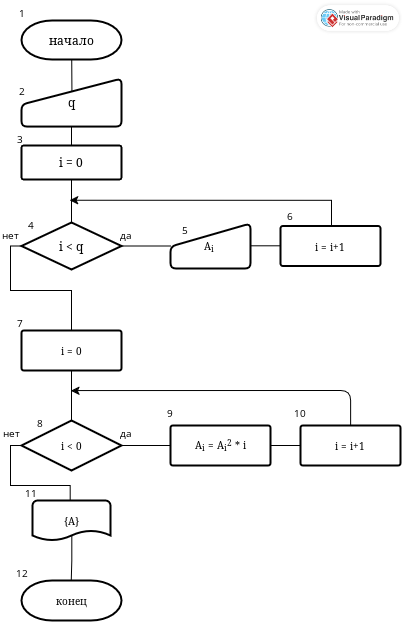

# Задание 1

1. Постановка задачи
   
   Пересчитать значения элементов одномерного массива Т размерности q, возведя их в квадрат и умножив на значение своего индекса.
   
   **Входные данные:**
   
   Размерность массива q
   
   **Выходные данные:**
   
   преобразованный массив

2. Математическая модель
   
   x<sub>i</sub> = n<sup>2</sup>*i

3. Разработка алгоритма
   
   

4. Код программы
   
   ```c
   #include <stdio.h>
   
   int main() {
     // создаём массив
     printf("Введите желаемую длину массива\n");
     int q; scanf("%d", &q);
     int T[q];
   
     // заполняем его
     printf("введите значение T[i]\n");
     for (int i = 0; i<q; i++){
       printf("T[%d]=", i+1);
       scanf("%d", T+i);
     }
   
     // выводим новый массив
     for (int i = 0; i<q; i++){
       printf("%d ", T[i]*T[i]*i);
     }
     return 0;
   }
   ```

5. Отладка
   
   

# Задание 2

1. Постановка задачи
   
   
   
   **Входные данные**
   
   кол-во строк и столбцов массива
   
   **Выходные данные**
   
   массив нужного вида

2. Математическая модель
   
   x<sub>ij</sub> = i

3. Разработка алгоритма
   
   

4. Код программы
   
   ```c
   #include <stdio.h>
   
   int main() {
     printf("Введите желаемое кол-во строк матрицы\n");
     int countstr; scanf("%d", &countstr);
     printf("Введите желаемое кол-во столбцов матрицы\n");
     int countstlb; scanf("%d", &countstlb);
     int G[countstr][countstlb]; //объявление массива
   
     printf("\n");
   
     for (int str=0; str<countstr;str++)
     {
       for (int stlb=0; stlb<countstlb;stlb++)
       {
         G[str][stlb]=str;
       }
     }
     for (int stro=0; stro<countstr; stro++)
     {
       for (int stolb=0; stolb<countstlb; stolb++)
       {
         printf("%d ", G[stro][stolb]);
       }
     printf("\n");
     }
     return 0;
   }
   ```

5. Отладка
   
   
