### Задание 1

1. Задание

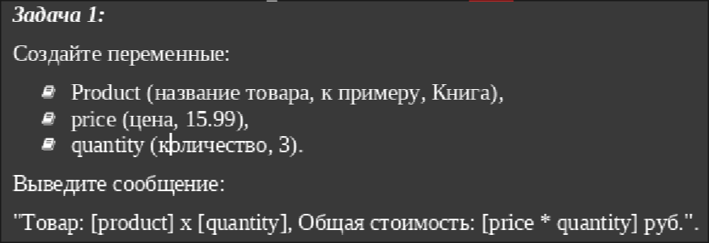 

2. Листинг

```python
def main():
    product = "Книга"
    price = 15.99
    quantity = 3
    print(f"Товар: {product} x {quantity}, Общая стоимость: {price * quantity} руб")


main()
```

3. Вывод программы


### Задание 2

1. Задание<br>
    Напишите код, который проверяет, является ли число четным. Выведите: "Четное" или "Нечетное".

2. Листинг

```python
import sys

def main():
    if int(sys.argv[1])%2 == 1:print("Нечётное")
    else:print("Чётное")

main()
```

3. Вывод программмы

(out2.png)

### Задание 3

1. Задание <br>
    Напишите цикл, который выводит квадраты чисел от 1 до 5

2. Листинг

```python
def main():
    for i in range(5):
        print((i+1)**2)


main()
```

3. Вывод

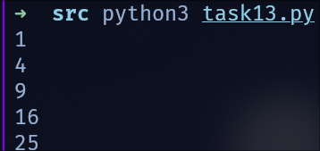

### Задание 4

1. Задача<br>
    Напишите код, который запрашивает у пользователя его город и год рождения, а затем выводит сообщение:  "Вы живете в [город] и родились в [год]." 

2. Листинг

```python
import sys

def main():
    # город sys.argv[1]
    # год sys.argv[2]
    city = sys.argv[1]
    year = int(sys.argv[2])
    print(f"u're living in the Russian city named by {city} and born in {year} year")

main()
```

3. Вывод

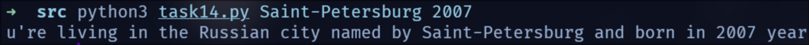

### Задание 5

1. Задача<br>
   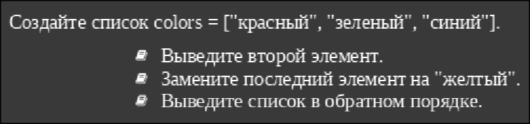 

2. Листинг

```python
import sys

def main():
    colors = ["red", "green", "blue"]
    print(colors[1])
    colors[-1] = "yellow"
    print(colors[::-1])

main()
```

3. Вывод

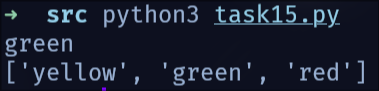

### Задание 6

1. Задача<br>
   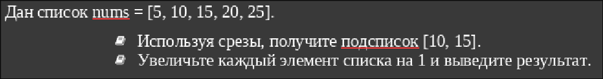 

2. Листинг

```python
import sys

def main():
    spis = [5, 10, 15, 20, 25]
    print (spis[1:3])

    for i in range(len(spis)):
        spis[i]+=1
        print(spis[i])

main()
```

3. Вывод

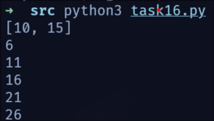

### Задание 7

1. Задача<br>
   Напишите функцию is_positive(num), которая возвращает True, если число положительное, и False в противном случае. 

2. Листинг

```python
import sys


def is_positive(x):
    return True if x>0 else False


def main():
    print(is_positive(int(sys.argv[1])))

main()
```

3. Вывод

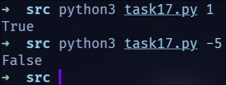

### Задание 8

1. Задача<br>
   Напишите код, который запрашивает у пользователя два числа и выводит их сумму. Обработайте случай, если введены не числа.

Код безвозвратно утерян, ибо следующую восьмую задачу я писал в тот же самый task18.py, учитывая, что я писал демона под уведомления о низком заряде на питоне, можно поверить что оно работало, да?

### Задание 8

1. Задача<br>
   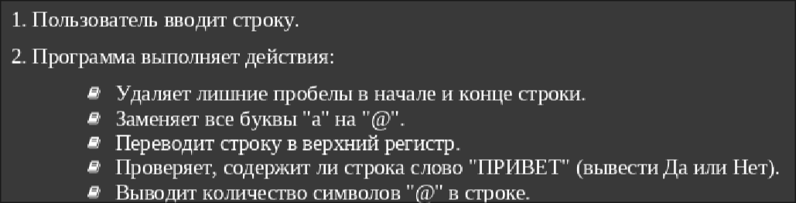

2. Листинг

```python
import sys

def main()
    text = input("")
    text = text.strip()
    text = text.replace('а', '@')
    text = text.upper()

    if "ПРИВЕТ" in text:print("Да")
    else:print("Нет")

    print(text.count('@'))

main()
```

3. Вывод

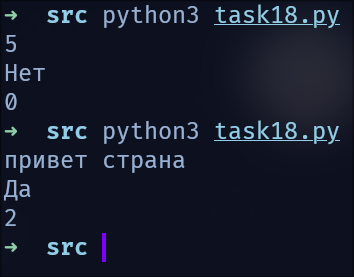

### Задание 9

1. Задача<br>
   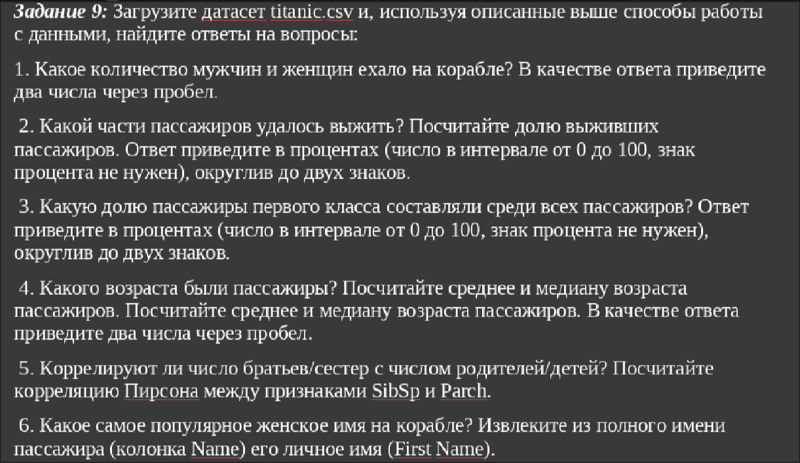

2. Листинг

```python
import pandas as pd
import head19 as hd

def main():
    data = pd.read_csv('titanic.csv', \
            index_col = 'PassengerId', \
            encoding='cp1251', \
            sep=';')


    maleCnt = hd.getCntSex(data, 'male')
    femaleCnt = hd.getCntSex(data, 'female')
    print("1.", femaleCnt, maleCnt)

    print("2.",hd.getCntSurvived(data))

    print("3.", hd.getCntRich(data))

    print("4.", hd.getAgeStat(data))

    print("5.", hd.corr(data))


if __name__ == "__main__":
    main()
```

header

```python
import pandas as pd

def getCntSex(data, sex):
    return (data['Sex'] == sex).sum()


def getCntSurvived(data):
    return round((data['Survived'].value_counts(normalize=True))*100, 2)


def getCntRich(data):
    classes = data["Pclass"].value_counts(normalize=True)
    fstClass = classes[1]

    return round(fstClass,2)


def ageToNum(age):
    if pd.isna(age):return None

    try:
        age = str(age).strip()
        if not age:return None
        age = age.replace(",",".")
        return float(age)
    except:
        return None


def getAgeStat(data):
    ages = data['Age'].apply(ageToNum) 
    avAge = round(ages.mean(), 2)
    medianAge = round(ages.median(), 2)
    return float(avAge), float(medianAge)

def corr(data):
    sibsp = pd.to_numeric(data['SibSp'], errors='coerce')
    parch = pd.to_numeric(data['Parch'], errors='coerce')
    return round(sibsp.corr(parch, method='pearson'), 2)
```

3. Вывод

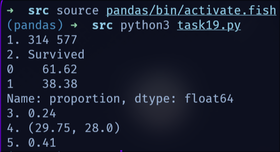

### Задание 10-12

1. Задача<br>
   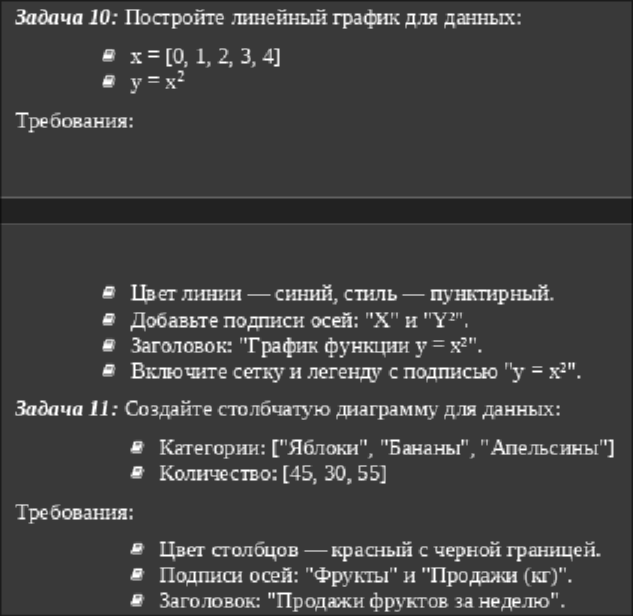<br>
   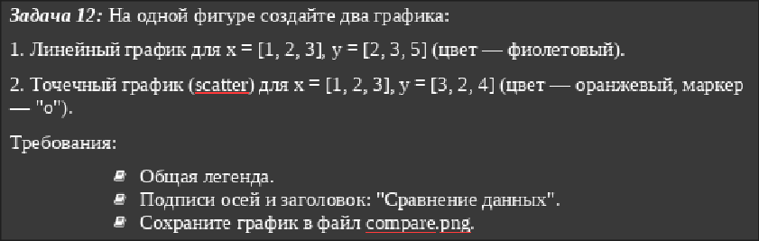

2. Листинг

```python
import matplotlib.pyplot as plt
import head110 as hd


def main():
    hd.taskOne()
    hd.taskTwo()
    hd.taskThree()


if __name__ == "__main__":
    main()
```

header

```python
import matplotlib.pyplot as plt

def graphTask(x,y, color, title, xlbl, ylbl, grid, tyl):
    # Построение графика
    plt.plot(x, y, label="Линия данных", color="green", linestyle=tyl)
    plt.xlabel(xlbl)         
    plt.ylabel(ylbl)         
    plt.title(title)  # Заголовок
    plt.grid(grid)              
    plt.legend()                
    plt.savefig('myGraph.png')

def taskOne():
    x = [0,1,2,3,4]
    y = [q**2 for q in x]
    color = "blue"
    title = "Function y=x^2"
    xlbl = "x"
    ylbl = "x^2"
    grid = True
    tyle = "--"
    graphTask(x,y, color, title, xlbl, ylbl, grid, tyle)

    plt.close()

def taskTwo():
    categories = ["Яблоки", "Бананы", "Апельсины"]
    quantities = [45, 30, 55]

    plt.bar(categories, quantities, color="red", edgecolor='black', linewidth=1.5)

    plt.title("Продажи фруктов за неделю")
    plt.xlabel("Фрукты")         
    plt.ylabel("Продажи (кг)")         
    plt.grid(True)

    plt.savefig('diagram.png')
    plt.close()
    #Захардкодить реально проще...

def taskThree():
    x = [1, 2, 3]
    y_graph = [2, 3, 5]
    y_bar = [3, 2, 4]

    plt.plot(x, y_graph, color='purple', label='Линейный график')
    plt.scatter(x, y_bar, color='orange', marker='o', label='Точечный график')

    # Подписи и заголовок
    plt.xlabel('X')
    plt.ylabel('Y')

    # Легенда и сетка
    plt.legend()
    plt.grid(True)

    plt.savefig('compare.png')
    plt.close()
```

3. Вывод

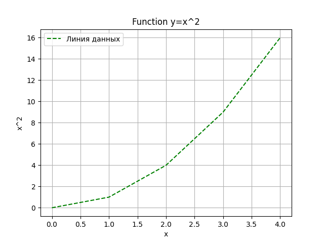<br>
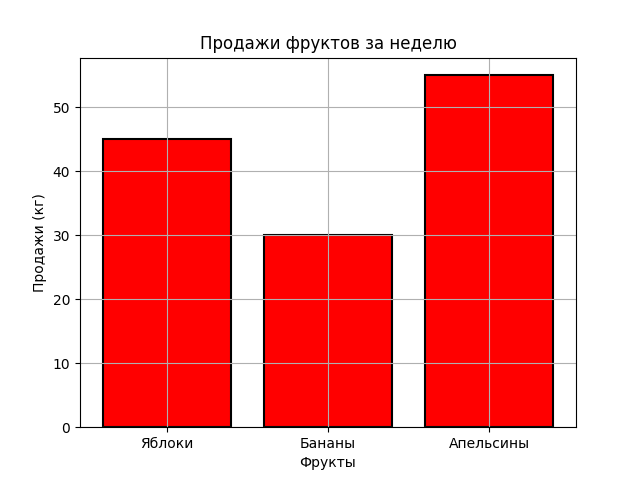<br>
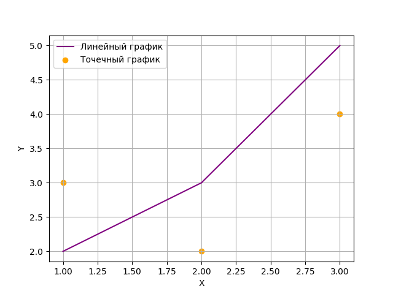
