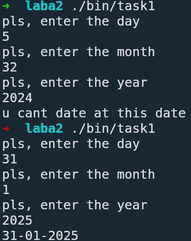
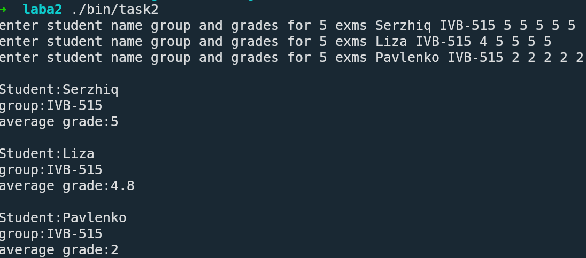
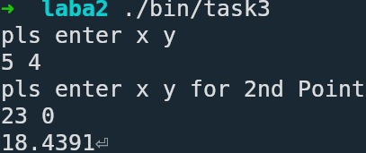
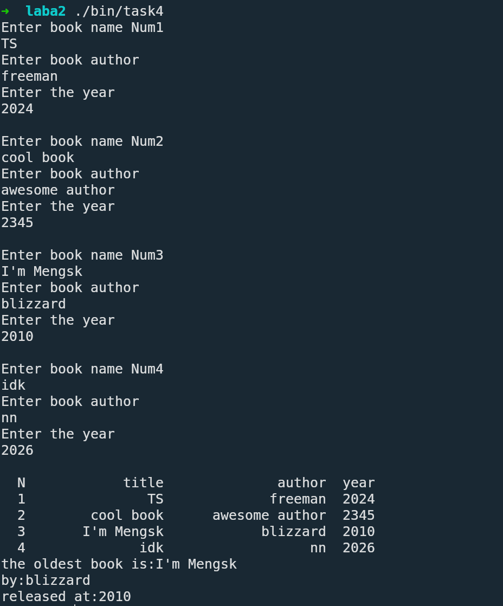
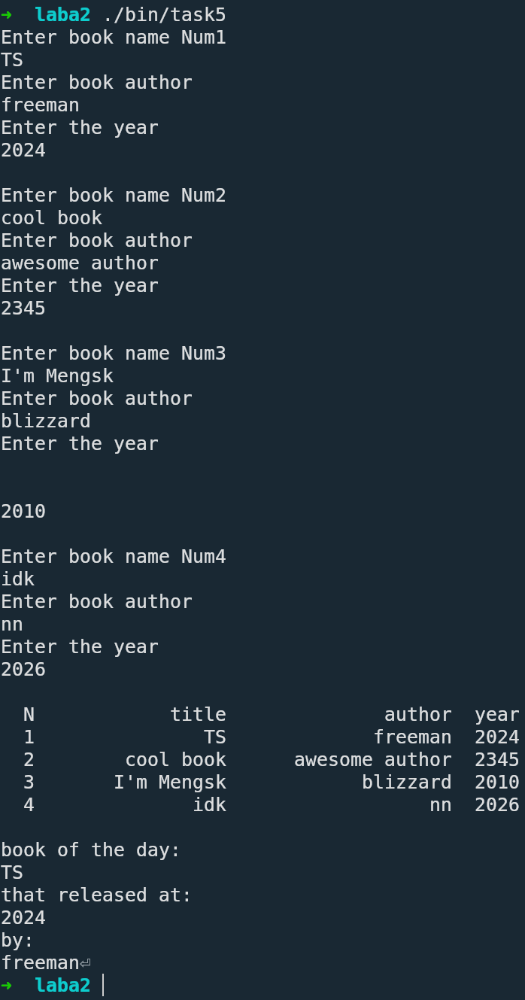

<div align="center">

МИНИСТЕРСТВО ТРАНСПОРТА РОССИЙСКОЙ ФЕДЕРАЦИИ  
ФЕДЕРАЛЬНОЕ АГЕНТСТВО ЖЕЛЕЗНОДОРОЖНОГО ТРАНСПОРТА  
Государственное бюджетное образовательное учреждение  
высшего образования  
**«ПЕТЕРБУРГСКИЙ ГОСУДАРСТВЕННЫЙ УНИВЕРСИТЕТ  
ПУТЕЙ СООБЩЕНИЯ ИМПЕРАТОРА АЛЕКСАНДРА I»**  

Кафедра «ИНФОРМАЦИОННЫЕ И ВЫЧИСЛИТЕЛЬНЫЕ СИСТЕМЫ»  

---

Дисциплина: «Программирование C++»

<br><br><br>
<br><br><br>

### О Т Ч Е Т

### по лабораторной работе № 2

</div>

<br><br><br>
<br><br><br>

<div align="right">
  <table align="right" style="border: none;">
    <tr>
      <td style="text-align: left; border: none;">
        Выполнил студент<br>
        Факультета АИТ<br>
        Группы ИВБ-515<br>
        Принял
      </td>
      <td style="text-align: right; border: none; vertical-align: bottom; padding-left: 50px;">
        Нартов С. А.<br>
        <br>
        <br>
        Хетчиков Д.М.
      </td>
    </tr>
  </table>
</div>

<br><br><br>
<br><br><br>
<br><br><br>
<br><br><br><br><br>

<div align="center">
  Санкт-Петербург<br>  
  2026<br>
</div>

# *Цель Работы*

Освоить работу со структурами (struct) в языке C++: научиться определять структуры, создавать переменные-экземпляры,
заполнять поля, передавать структуры в функции, работать с массивами структур и указателями на структуры.

# *Краткая теория*

Структура в языке C++ — это пользовательский тип данных, который позволяет объединить несколько переменных разных типов под одним именем.
Это удобно для хранения связанных между собой данных.
Структуры могут содержать поля различных типов, в том числе массивы, другие структуры и указатели.
Доступ к полям структуры осуществляется через оператор . для обычной переменной и через оператор -> для указателя.
Структуры можно передавать в функции, возвращать из функций, а для повышения эффективности большие структуры обычно передаются по ссылке или указателю.

# *Задачи*

## Задание 1

Листинг

```cpp
#include <iostream>
#include <iomanip>
using namespace std;

struct Date {
  int day;
  int month;
  int year;
};

int validateDate(Date date){
  if (date.month < 1 || date.month > 12
                  || date.day < 1
                  || date.year < 1)return 1;

  int dayofmonths[] = {0,31,28,31,30,31,30,31,31,30,31,30,31};
  //             0 01 02 03 04 05 06 07 08 09 10 11 12
  if (date.year%4 == 0 && date.year%100 != 0 || date.year%400 == 0)dayofmonths[2]=29;
  if (date.day > dayofmonths[date.month]) return 1;

  return 0;
}

int main() {
  Date dat;

  cout << "pls, enter the day\n";
  cin >> dat.day;

  cout << "pls, enter the month\n";
  cin >> dat.month;

  cout << "pls, enter the year\n";
  cin >> dat.year;

  if (validateDate(dat) == 1){
    cerr << "u cant date at this date" << endl;
    return 1;
  }

  cout << setfill('0') << setw(2) << dat.day;
  cout << "-";
  cout << setfill('0') << setw(2) << dat.month;
  cout << "-";
  cout << dat.year << endl;
}
```



## Задание 2

Листинг

```cpp
#include <iostream>
using namespace std;
#define CNT 3

double calcAverage(const int grades[], int size);

struct Student{
  string name;
  string group;
  int grades[5];
};

int main(){
  Student IVB[3];
  for (int i=0; i<CNT; i++){
    cout << "enter student name group and grades for 5 exms";
    cin >> IVB[i].name >> IVB[i].group;
    for (int q=0; q<5; q++)cin >> IVB[i].grades[q];
  }

  cout << endl;

  for (int i=0; i<CNT; i++){
    cout << "Student:" << IVB[i].name;
    cout << "\ngroup:" << IVB[i].group;
    cout << "\naverage grade:" << calcAverage(IVB[i].grades, 5);
    cout << endl << endl;
  }


/*
  for (int i=0; i<3; i++){
    cout << IVB[i].name << IVB[i].group;
    for (int q=0; q<5; q++)cout << IVB[i].grades[q];
  }
*/
}


double calcAverage(const int grades[], int size){
  double ave = 0;
  for (int q = 0; q<size; q++){
    if (grades[q] > 5 || grades[q] < 2)exit(1);
    ave+=(double)grades[q];
  }
  ave /= size;
  return ave;
}
```



## Задание 3

Листинг

```cpp
#include <iostream>
#include <cmath>
using namespace std;

struct Point{
  double x;
  double y;
};

double distance(const Point& p1, const Point& p2);

int main(){
  Point dots[2];

  cout << "pls enter x y" << endl;
  cin >> dots[0].x >> dots[0].y;

  cout << "pls enter x y for 2nd Point" << endl;
  cin >> dots[1].x >> dots[1].y;

  cout << distance(dots[0], dots[1]);
  return 0;
}


double distance(const Point& p1, const Point& p2){
  return sqrt(pow(p2.x-p1.x, 2) + pow(p2.y-p1.y, 2));
}
```



## Задание 4

Листинг

```cpp
#include <iostream>
#include <iomanip>

using namespace std;

struct Book{
  string title;
  string author;
  int year;
};


int findOldInd(const Book libr[], int N);


int main(){
  const int N = 4;
  Book libr[N];

  for (int i=1; i <= N; i++){
    std::cout << "Enter book name Num" << i << endl;
    cin.ignore(i == 1 ? 0 : 1, '\n');
    getline(cin, libr[i-1].title);
    cout << "Enter book author" << endl;
    getline(cin, libr[i-1].author);
    cout << "Enter the year" << endl;
    cin >> libr[i-1].year;
    cout << endl;
  }

  cout << setw(3) << "N" << setw(17) << "title" << setw(20) << "author" << setw(6) << "year" << endl;
  for (int i=0; i < N; i++){
    cout << setw(3) << i+1 << setw(17) << libr[i].title << setw(20) << libr[i].author << setw(6) << libr[i].year << endl;
  }

  int indexOfOld = findOldInd(libr, N);
  cout << "the oldest book is:" << libr[indexOfOld].title << '\n';
  cout << "by:" << libr[indexOfOld].author << '\n';
  cout << "released at:" << libr[indexOfOld].year << endl;
  return 0;
}

int findOldInd(const Book libr[], int N){
  int minYearInd = 0;
  for (int i = 1; i < N; i++) {
    if (libr[i].year < libr[minYearInd].year) {
      minYearInd = i;
    }
  }
  return minYearInd;
}
```



## Задание 5

Листинг

```cpp
#include <cstdlib>
#include <ctime>
#include <iostream>
#include <iomanip>
#include <new>

using namespace std;

struct Book{
  string title;
  string author;
  int year;
};


void printBook(const Book* book);


int main(){
  const int N = 4;
  Book* library = new(nothrow) Book[N];

  if (library == nullptr){
    cerr << "ошибка выделения памяти" << endl;
    return 1;
  }

  for (int i=0; i < N; i++){
    std::cout << "Enter book name Num" << i+1 << endl;
    cin.ignore(i == 0 ? 0 : 1, '\n');
    getline(cin, (library + i) -> title);
    cout << "Enter book author" << endl;
    getline(cin, (library + i) -> author);
    cout << "Enter the year" << endl;
    cin >> (library + i) -> year;
    cout << endl;
  }

  cout << setw(3) << "N" << setw(17) << "title" << setw(20) << "author" << setw(6) << "year" << endl;
  for (int i=0; i < N; i++){
    cout << setw(3) << i+1 << setw(17) << (library + i) -> title << setw(20) << (library + i) -> author << setw(6) << (library + i) -> year << endl;
  }

  cout << endl;
  srand(time(NULL));
  int bookOfDay = rand()%N;
  printBook((library+bookOfDay));

  delete[] library;

  return 0;
}

/*
  а теперь, как я это ваще понял, мы обращаемcя к полю указателя
  тобишь по адресу "Русановская" к полю, свойственному каждому схоже адресу(это уже базово для структур)
*/ 

void printBook(const Book* book){
  cout << "book of the day:\n" << book -> title
    << "\nthat released at:\n" << book -> year << "\nby:\n" << book ->author;
  return;
}
```




