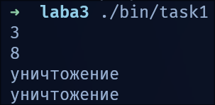
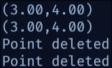
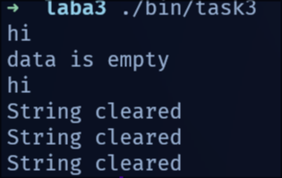
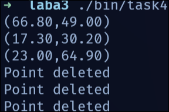
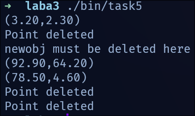

<div align="center">

МИНИСТЕРСТВО ТРАНСПОРТА РОССИЙСКОЙ ФЕДЕРАЦИИ  
ФЕДЕРАЛЬНОЕ АГЕНТСТВО ЖЕЛЕЗНОДОРОЖНОГО ТРАНСПОРТА  
Государственное бюджетное образовательное учреждение  
высшего образования  
**«ПЕТЕРБУРГСКИЙ ГОСУДАРСТВЕННЫЙ УНИВЕРСИТЕТ  
ПУТЕЙ СООБЩЕНИЯ ИМПЕРАТОРА АЛЕКСАНДРА I»**  

Кафедра «ИНФОРМАЦИОННЫЕ И ВЫЧИСЛИТЕЛЬНЫЕ СИСТЕМЫ»  

---

Дисциплина: «Программирование C++»

<br><br><br>
<br><br><br>

### О Т Ч Е Т

### по лабораторной работе № 3

</div>

<br><br><br>
<br><br><br>

<div align="right">
  <table align="right" style="border: none;">
    <tr>
      <td style="text-align: left; border: none;">
        Выполнил студент<br>
        Факультета АИТ<br>
        Группы ИВБ-515<br>
        Принял
      </td>
      <td style="text-align: right; border: none; vertical-align: bottom; padding-left: 50px;">
        Нартов С. А.<br>
        <br>
        <br>
        Хетчиков Д.М.
      </td>
    </tr>
  </table>
</div>

<br><br><br>
<br><br><br>
<br><br><br>
<br><br><br><br><br>

<div align="center">
  Санкт-Петербург<br>  
  2026<br>
</div>

# *Цель Работы*

Освоить основы объектно-ориентированного программирования в C++: научиться определять классы, создавать объекты, работать с конструкторами и деструкторами, понимать жизненный цикл объектов.

# *Краткая теория*

Класс — пользовательский тип данных, объединяющий поля (данные) и методы (функции) в единый объект.<br>
Для инициализации объектов используются конструкторы. Они автоматически вызываются при создании объекта. Деструктор вызывается автоматически при уничтожении объекта и используется для освобождения ресурсов, например динамической памяти. Если класс работает с new, то обычно нужен корректный деструктор и конструктор копирования, чтобы избежать ошибок копирования и двойного освобождения памяти.<br>


# *Задачи*

## Задание 1

Листинг

```cpp
#include <iostream>

using namespace std;

class Counter{
  private:
    int value;
  public:
    Counter(){
      value = 0;
    }

    Counter(int start){
      value = start;
    }

    void increment(){
      value++;
    }

    int getValue(){
      return value;
    }

    ~Counter() {
      cout << "уничтожение" << endl;
    }
};

int main(){
  Counter countDef;//Default
  Counter countSpec(5);//Specific

  for (int i = 0; i < 3; i++){
    countDef.increment(); countSpec.increment();
  }

  cout << countDef.getValue() << endl << countSpec.getValue() << endl;
  return 0;
}
```



## Задание 2

Листинг

```cpp
#include "Point.h"
using namespace std;

int main(){
  Point p1(3.0, 4.0);
  Point p2 = p1;

  p1.print();
  p2.print();

  return 0;
}
```

Листинг Point.h

```cpp

#include <cstdio>
#include <iostream>

class Point{

private:
  double x; double y;

public:
  Point(){x=0;y=0;}

  Point(double strtx, double strty){y=strty;x=strtx;}

  Point(const Point& newclass){x = newclass.x; y = newclass.y;}

  void print(){printf("(%.2lf,%.2lf)\n", x, y);}

  ~Point() {std::cout << "Point deleted" << std::endl;}
};
```



## Задание 3

Листинг

```cpp
#include <cstring>
#include <iostream>
using namespace std;

class String{

private:
  char* data;

public:
  String(){data = nullptr;}


  String(const char* str){
    if (str != nullptr){
      data = new char[strlen(str)+1];
      strcpy(data, str);
    } else {data = nullptr;}
  }


  String(const String& str){
    if (str.data != nullptr){
      data = new char[strlen(str.data)+1];
      strcpy(data, str.data);
    } else {
      data = nullptr;
    }
  }

  void print(){
    if (data != nullptr){
      cout << data << endl;
    } else {cout << "data is empty" << endl;}
  }

  ~String(){
    cout << "String cleared" << endl;
    delete [] data;
  }
};

int main() {
  String s1("hi");
  String s2;
  String s3 = s1;

  s1.print();
  s2.print();
  s3.print();
}
```



## Задание 4

Листинг
```cpp

#include "Point.h"
#include <cstdlib>
using namespace std;

int main(){
  srand(time(NULL));

  Point massPoints[] = {
    Point((double)(rand()%1000)/10, (double)(rand()%1000)/10),
    Point((double)(rand()%1000)/10, (double)(rand()%1000)/10),
    Point((double)(rand()%1000)/10, (double)(rand()%1000)/10)
  };

  for (int i = 0; i < 3; i++){
    massPoints[i].print();
  }

  return 0;
}
```



## Задание 5

Листинг

```cpp
#include "Point.h"
#include <cstdlib>
#include <memory>
using namespace std;

int main(){
  srand(time(NULL));

  Point* newobj = new Point(3.2, 2.3);
  newobj -> print();
  delete newobj;
  cout << "newobj must be deleted here" << endl; // ну тут ок, создаём указатель, вспоминаем третью или какую там задачу
  
  Point p((double)(rand()%1000)/10, (double)(rand()%1000)/10);
  Point& ref = p;
  ref.print();

  

  unique_ptr<Point> smartassPoint = make_unique<Point>(
    (double)(rand()%1000)/10, (double)(rand()%1000)/10
  );
  smartassPoint->print();
  return 0;
}
```




