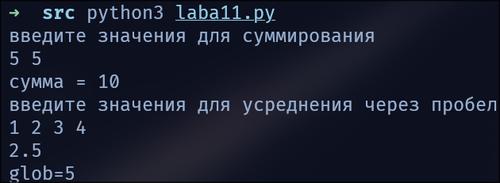
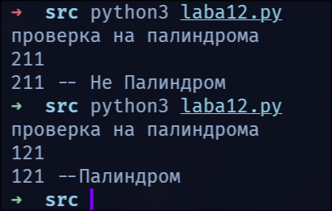

# Цель работы

1. повторение синтаксиса языка python

2. повторение работы локальных и глобальных переменных

# Задание

**Задание 1**

1. Создайте
   программу на языке Python, которая демонстрирует создание и 
   использование функций, передачу параметров в функции, а также различные 
   области видимости переменных:
- создайте функцию, которая принимает два аргумента (целочисленные значения) и возвращает их сумму;

- создайте функцию, которая принимает список чисел и возвращает среднее арифметическое этих чисел;

- создайте глобальную переменную и продемонстрируйте доступ к ней внутри функции;

- создайте локальную переменную внутри функции и объясните, почему она недоступна вне функции.
2. Решите задачу:  
   Напишите функцию palindrome(s), которая принимает в качестве параметра строку и определяет, является ли она палиндромом. Функция должна возвращать строку «Палиндром» или «Не палиндром» соответственно.

3. В банке «Литровый» хотят установить сейф. Программистами этого банка уже написан генератор случайных пин-кодов для сейфа. Пин-код имеет вид b-c, где a, b, c — натуральные числа. Но директор хочет, чтобы его 
   сейф был защищен пин-кодом специального вида: число a должно быть 
   простым, число b должно быть палиндромом, число c должно быть степенью войки.
   
   Напишите функцию check_pin(pin_code), которая проверяет, является ли пин-код корректным и возвращает необходимый вердикт «Корректен» или «Не корректен».

# Выполнение работы

1. Задача 1

```python
#laba11.py
glob = 5


def summa(a, b):
    return a+b


def srarf(a):
    return sum(a)/len(a)  # длина массива на его размер


def main():
    a, b = [int(x) for x in input("введите значения для суммирования\n").split()]
    print("сумма =", summa(a, b))

    ls = [int(x) for x in input("введите значения для усреднения через пробел\n").split()]
    print(srarf(ls))

    print("glob=", glob, sep='')

    loc = 5
    # после завершения функции, память о переменных в ней очистится


if __name__ == "__main__":
    main()
```

1. Выполнено кодирование решения – составлена программа на языке Python.программа работает корректно



2. Задание 2

```python
#laba12.py
def palindrome(pali):
    pali = str(pali)
    flag = 1
    lenstr = len(pali)//2
    for i in range(lenstr):
        if pali[i] != pali[-(i+1)]:
            flag = 0
            break
    # если не палиндром, то найдётся такой элемент, что pali[i]!=pali[-(i+1)]

    if flag == 1:
        return ['y', f"{pali} --Палиндром"]
    return ['n', f"{pali} -- Не Палиндром"]


def main():
    s = input("проверка на палиндрома\n")
    print(palindrome(s)[1])


if __name__ == "__main__":
    main()
```

программа работает корректно



3. Задание 3

```python
#laba13.py
import laba12
import labahead
import sys


def main():
    # готовим флаги, чтоб знать, почему код не подходит
    flag1 = 0
    flag2 = 0
    flag3 = 0

    # получаем a-b-c
    code = sys.argv[1]
    a, b, c = [int(x) for x in code.split('-')]
    if labahead.simple(a) == 'y':
        flag1 = 1
    if laba12.palindrome(b)[0] == 'y':
        flag2 = 1
    if labahead.step(c) == 'y':
        flag3 = 1

    if flag1 + flag2 + flag3 == 3:
        print('Корректен')
    else:
        print('flag1=', flag1, 'flag2=', flag2, 'flag3=', flag3, sep='')


if __name__ == "__main__":
    main()
```

header

```python
#labahead.py
# проверяем, что простое
def simple(x):
    for i in range(2, (int(x**(1/2))//1+1)):  # проходим до корня из числа
        # если x делится на число, не равное себе/1, оно не простое
        if x % i == 0:
            return 'n'
    return 'y'
    # простое? y/n


# проверяем на степень двойки
def step(c):
    x = 1
    while x < c:
        x *= 2
        if x == c:
            return 'y'
    # брутфорсим степени двойки
    return 'n'
```

программа работает корректно

# Выводы

1. Выполнено кодирование решения – составлена программа на языке Python.
2. Перебор до корня из числа используется для оптимизации программы, т.к. без этой оптимицазии, выполнение может сильно затянуться
3. Закреплены знания в работе с python, в частности, с его функциями
4. Поставленная цель (цели) работы выполнена (ы) в полном объеме.
